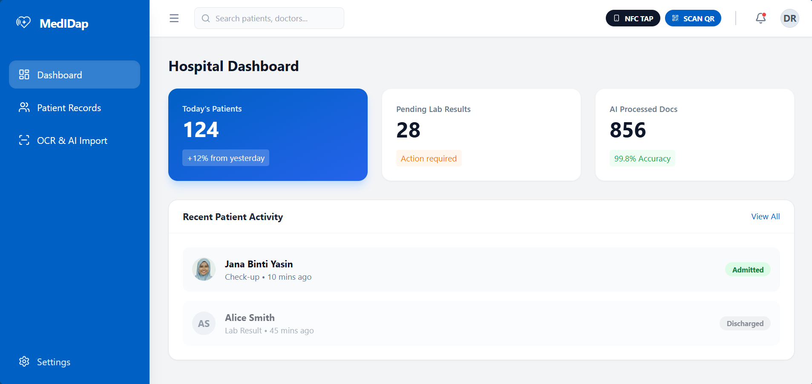

# MedIDap Hospital Portal

<div align="center">
  
  <br>
  <strong>Next-Generation Hospital Interface for Seamless Data Integration</strong>
</div>

<br>

## Overview

**MedIDap Hospital Portal** is a specialized web interface designed for healthcare providers. It streamlines the process of ingesting, standardizing, and viewing patient medical records. 

The core power of MedIDap lies in its integration with **Google Gemini AI**. By leveraging multimodal AI, the portal allows hospital staff to convert unstructured data—whether from physical paper scans or quick handwritten notes—into standardized **HL7 FHIR R4** (Fast Healthcare Interoperability Resources) JSON data, ready for integration into the hospital's database.

Demo: https://medidap.netlify.app/

## Key Features



### 1. 🏥 Interactive Dashboard
*   **Real-time Analytics:** View daily patient counts, pending lab results, and AI processing stats.
*   **Activity Feed:** Monitor recent patient admissions and discharges.
*   **Quick Actions:** Fast access to NFC Tapping, QR Scanning, and Patient Records.

### 2. 🤖 AI-Powered Data Ingestion
MedIDap uses **Gemini 2.5 Flash** to bridge the gap between physical and digital records.

*   **Optical Character Recognition (OCR) & Extraction:**
    *   Upload images of lab reports, prescriptions, or discharge summaries.
    *   Vision AI analyzes the image, reads the text, and interprets medical context.
    *   Extracts diagnostics, test results (with units), and doctor notes.
*   **Natural Language Processing (NLP):**
    *   **Manual Entry Mode:** Doctors or nurses can type raw, unstructured clinical notes.
    *   The AI structures this text into organized medical data automatically.
*   **FHIR Standardization:**
    *   All AI outputs are converted into valid FHIR R4 Bundle JSON format (`Patient`, `DiagnosticReport`, `Observation`, `Condition` resources).

### 3. 📂 Electronic Health Records (EHR) Viewer
*   **Patient Profiles:** Comprehensive view of demographics, allergies, chronic conditions, and active medications.
*   **Medical History Timeline:** Chronological list of hospital visits and reports.
*   **Smart Filtering:** Filter records by:
    *   Specialty (e.g., Cardiology, Endocrinology)
    *   Location (Hospital/Clinic)
    *   Status (Normal, Elevated, Low)
*   **Detailed Findings:** Expandable records showing clinical findings alongside tabulated lab results with reference ranges and status indicators.
*   **Raw Data Access:** Developers and admins can toggle a view of the raw FHIR JSON source for every record.

### 4. 🔗 Connectivity Simulations
*   **NFC Tap:** UI simulation for authenticating patients via NFC-enabled Medical IDs.
*   **QR Scan:** Interface for scanning patient QR codes for instant record retrieval.

## Technology Stack

*   **Frontend:** React 19, TypeScript
*   **Styling:** Tailwind CSS
*   **Icons:** Lucide React
*   **AI & Logic:** Google GenAI SDK (`gemini-2.5-flash-lite`)

## Setup & Configuration

1.  **Environment Variables:**
    The application requires a Google Gemini API Key to function.
    Ensure `VITE_GEMINI_API_KEY` is set in your `.env` file (Vite automatically prefixes with `VITE_`).

2.  **Installation:**
    ```bash
    npm install
    ```

3.  **Run Development Server:**
    ```bash
    npm run dev
    ```

## Usage Flow

1.  **Dashboard:** Start at the overview to see hospital status.
2.  **Import Data:** Navigate to "OCR & AI Import".
    *   *Option A:* Upload a photo of a medical document.
    *   *Option B:* Switch to "Manual Entry" and type clinical notes.
    *   Click "Convert/Scan" to let AI process the data.
3.  **Review & Integrate:** Review the generated FHIR JSON and extracted fields. Click "Integrate to Patient Record".
4.  **View Record:** The system redirects to the Patient View, where the new data appears at the top of the history list, fully formatted and searchable.
