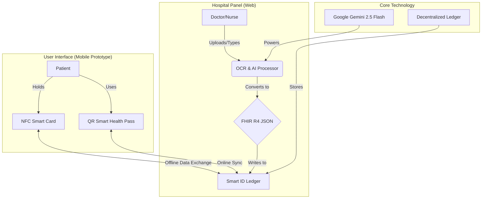

# MedIDap: AI-Powered Decentralized Health Identity


<br>

## 🚀 Overview

**MedIDap** is a unified, portable medical identity ecosystem designed to bridge the gap between physical paper records, digital hospital silos, and decentralized patient ownership. 

It enables a seamless flow of medical information across all healthcare touchpoints—from rural clinics to major hospitals—without requiring complex backend integrations or national database overhauls.

### 🔴 The Problem
*   **Fragmentation**: Patient records are trapped in hospital silos.
*   **Paper Burden**: Elderly patients carry physical folders, logbooks, and CDs.
*   **Connectivity**: Remote clinics lack reliable broadband for centralized database access.
*   **Safety Risks**: Lack of complete history leads to dangerous medication conflicts and duplicate testing.

### 🟢 The Solution
MedIDap acts as a **decentralized bridge**:
1.  **AI Ingestion**: Vision AI converts physical papers (prescriptions, lab notes) into structured digital data (FHIR JSON) via the **Hospital Panel**.
2.  **Portable Identity**: Data is written to a **Smart ID Ledger** (NFC Card) for offline access or a **QR Health Pass** (Mobile App).
3.  **Universal Access**: Doctors tap the card or scan the QR code to instantly view the patient's complete history, regardless of where previous treatments occurred.

---

## 🏗️ Architecture & Ecosystem

MedIDap consists of two main components working in harmony:



### 1. 🏥 Hospital Panel (Web Portal)
A specialized interface for healthcare providers to ingest and standardize data.
*   **AI-Powered OCR**: Uses **Gemini 2.5 Flash** to read handwritten notes and lab reports from images.
*   **FHIR Standardization**: Automatically converts unstructured text into standard **HL7 FHIR R4** resources.
*   **Patient Record Viewer**: Displays a comprehensive, interactive timeline of the patient's health history.
*   **Tech Stack**: React 19, TypeScript, Tailwind CSS, Google GenAI SDK.

### 2. 📱 User Interface (Mobile App Prototype)
The patient-facing side of the ecosystem, designed for managing the decentralized identity.
*   **QR Smart Health Pass**: Instant identity verification for general users.
*   **NFC Card Management**: Manage the physical Smart Card (Freeze/Unfreeze, View Access Logs).
*   **Guardian Mode**: Allows caregivers to manage health records for elderly dependents.
*   **Tech Stack**: React 18, Vite, Tailwind CSS, Lucide React (Prototype for React Native).

---

## 🌟 Key Features

### For Healthcare Providers (Hospital Panel)
*   **30-Second Workflow**: Scan a prescription → AI structures it → Doctor confirms → Data synced.
*   **Clinical Decision Support**: AI automatically flags contraindications based on the full history.
*   **Offline Capability**: Read essential data (allergies, blood type, chronic conditions) directly from the NFC card chip without internet.

### For Patients (Mobile App)
*   **Zero-Paper Journey**: No need to carry physical documents.
*   **Privacy First**: No central surveillance. You own your data on your card/device.
*   **Accessibility**: Simple "Tap" interaction for elderly users via NFC card.

---

## 🛠️ Technology Stack

| Component | Tech |
| :--- | :--- |
| **Frontend Framework** | React (Vite) |
| **Language** | TypeScript |
| **Styling** | Tailwind CSS |
| **AI Model** | Google Gemini 2.5 Flash (Vision & NLP) |
| **Data Standard** | HL7 FHIR R4 (JSON) |
| **Mock Mobile View** | Browser DevTools (iPhone 14 Pro Max emulation) |

---

## 🚀 Getting Started

To run the entire ecosystem locally:

### Prerequisites
*   Node.js (v18+)
*   Google Gemini API Key

### 1. Setup Hospital Panel
```bash
cd Hospital_Panel
npm install
# Create .env file with VITE_GEMINI_API_KEY=your_key
npm run dev
```

### 2. Setup User Interface (Mobile Prototype)
```bash
cd User_Interface
npm install
npm run dev
```

**Mobile View Note**: For the Best experience with the User Interface, open your browser's Developer Tools (`F12`), toggle the Device Toolbar (`Ctrl+Shift+M`), and select **iPhone 14 Pro Max**.

---

## 🔮 Future Roadmap
1.  **React Native Migration**: Port the User Interface logic to a native mobile app for iOS and Android.
2.  **Hardware Integration**: Direct integration with NFC writer hardware in the Hospital Panel.
3.  **Blockchain Layer**: Finalize the decentralized ledger implementation for immutable audit trails.

---

<div align="center">
  <p><em>Empowering rural communities and the elderly with a true zero-paper health journey.</em></p>
</div>
